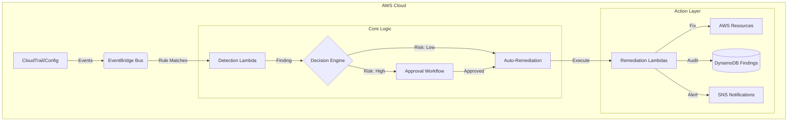

# 🛡️ Nebula Shield

> **Autonomous Cloud Security Orchestrator**
> *Event-driven, self-healing cloud security infrastructure that detects and fixes misconfigurations in real-time.*

[](https://github.com/MasterCaleb254/nebula-shield)
[](https://aws.amazon.com/cdk/)
[](https://www.python.org/)
[](LICENSE)

---

## 🌌 Mission

**Nebula Shield** is a self-remediating security system inspired by sci-fi "self-repairing hulls." It autonomously detects security drifts in your AWS environment and fixes them instantly while maintaining strict safety controls, immutable audit trails, and human-in-the-loop approval workflows for high-risk changes.

## 🏗️ Architecture

Nebula Shield operates on an event-driven architecture, ensuring near real-time response to security threats.



## ✨ Key Features

### 🔍 Real-Time Detection
- **S3 Buckets**: Instantly detects and blocks public access configurations.
- **IAM Roles**: Identifies over-permissive policies (e.g., `AdministratorAccess`) and unused credentials.
- **Security Groups**: Catches logical ports (22, 3389) open to the world (`0.0.0.0/0`).
- **Drift Detection**: Periodic scans to catch changes missed by event streams.

### 🛡️ Autonomous Remediation
- **Safety First**: Runs in `DRY_RUN` mode by default.
- **Automatic Rollback**: If a remediation fails validation, it immediately reverts changes.
- **Least Privilege**: Separate, narrowly-scoped Lambda functions for each service (S3, IAM, EC2).
- **Circuit Breakers**: Stops auto-remediation if failure rates spike.

### 🧪 Simulation & Testing
- **Local Simulation**: Test the entire pipeline locally with `simulation/` tools.
- **Event Replay**: Replay CloudTrail events to verify detection logic.
- **Dry-Run Validation**: Verify remediation intent without touching production resources.

## 🚀 Getting Started

### Prerequisites
- Python 3.9+
- AWS CDK (`npm install -g aws-cdk`)
- Docker (optional, for local Lambda testing)

### Installation

1. **Clone the repository**
   ```bash
   git clone https://github.com/MasterCaleb254/nebula-shield.git
   cd nebula-shield
   ```

2. **Set up Virtual Environment**
   ```bash
   python -m venv .venv
   source .venv/bin/activate  # Windows: .venv\Scripts\activate
   pip install -r infra/requirements.txt
   ```

3. **Run Local Simulation**
   Verify the system logic without deploying anything:
   ```bash
   python simulation/full_integration.py --mode=dry_run
   ```

## 📦 Deployment (AWS CDK)

Nebula Shield is deployed via AWS CDK, ensuring reproducible infrastructure.

1. **Configure Context**
   Edit `infra/cdk.json` to set your environment:
   ```json
   "nebulashield": {
     "account": "123456789012",
     "region": "us-east-1",
     "dry_run_mode": true
   }
   ```

2. **Deploy Stacks**
   Follow the safe rollout order:
   ```bash
   cd infra
   cdk deploy NebulaShieldCore-dev
   cdk deploy NebulaShieldDetection-dev
   cdk deploy NebulaShieldObservability-dev
   cdk deploy NebulaShieldRemediation-dev
   ```

   > 📘 **See the [Deployment Guide](infra/DEPLOYMENT_GUIDE.md) for detailed instructions.**

## 📂 Project Structure

```
nebula-shield/
├── infra/                  # Infrastructure as Code (CDK)
│   ├── stacks/            # Stack definitions (Core, Detection, Remediation)
│   └── lambdas/           # AWS Lambda handlers
├── src/                    # Application Logic
│   ├── detection/         # Detection rules
│   ├── decision_engine/   # Risk analysis & state machine
│   ├── remediation/       # Service-specific fix logic
│   └── models/            # Data models (Finding, Event, Plan)
├── simulation/             # Local testing harness
└── docs/                   # Architecture & Design docs
```

## 🔒 Security Principles

- **Control Plane Only**: No agents installed on EC2 instances.
- **Immutable Audit**: All findings and actions are logged to a tamper-evident DynamoDB table.
- **Fail-Safe**: Remediations default to rolling back on error.
- **Encryption**: All data at rest encrypted with KMS; in transit via TLS 1.2+.

## 🤝 Contributing

Contributions are welcome! Please read `CONTRIBUTING.md` before submitting PRs.

1. Fork the repo
2. Create feature branch (`git checkout -b feature/amazing-feature`)
3. Commit changes (`git commit -m 'Add amazing feature'`)
4. Push to branch (`git push origin feature/amazing-feature`)
5. Open a Pull Request

---

*Built with ❤️ by the Nebula Shield Team.*
